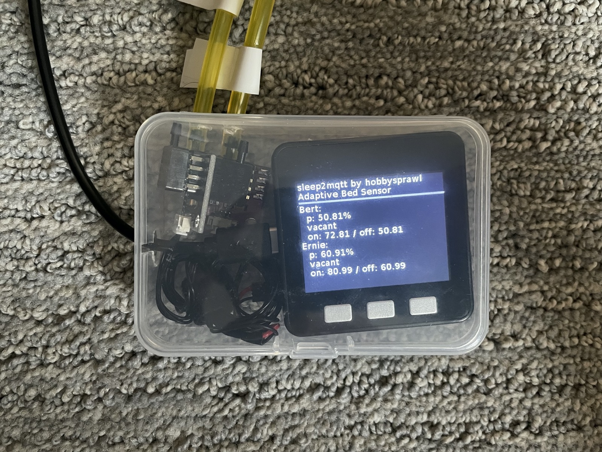

# sleep2mqtt - Bed Occupancy Sensor

## Hardware Assembly

Using the M5Stack core makes assembly a breeze. Each sensor came with leads for the 5V, G, and analog signal. All I did was wire the 5V and the G of both sensors together, and then plugged them into the the G and the 5V on the M5Stack. Each analog lead then plugged into one of the two analog inputs on the M5:

When connecting the air lines, make sure you connect them to the same port as pictured below. The other port is for vacuum. I am using a small 1/16" fuel line that I got at my local hardware store to connect to the little vacuum sensor hose barbs. 

To keep thing sfrom getting disconnected, I keep all of the parts in a small clear plastic case that the M5Stack came in. I drilled some small holes to route the hose lines and power.

The white air line is standard 1/8" silicon tubing, and it fits snugly over the harder yellow tubing. It does not leak at all and is hard to pull apart.

