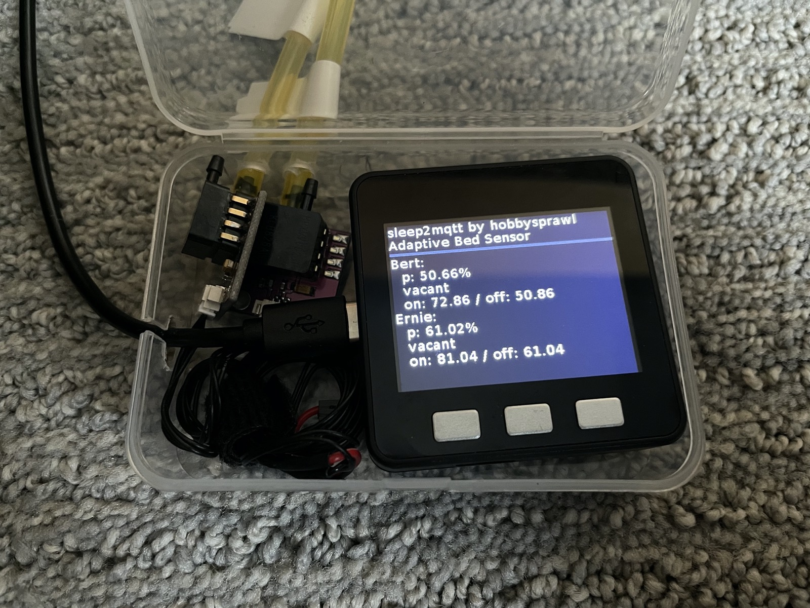

# sleep2mqtt - Bed Occupancy Sensor

## Hardware Assembly

Using the M5Stack core makes assembly a breeze. Each sensor came with leads for the 5V, G, and analog signal. All I did was wire the 5V and the G of both sensors together, and then plugged them into the the G and the 5V on the M5Stack. Each analog lead then plugged into one of the two analog inputs on the M5:

When connecting the air lines, make sure you connect them to the same port as pictured below. The other port is for vacuum. I am using a small 1/16" fuel line that I got at my local hardware store to connect to the little vacuum sensor hose barbs. 

To keep thing sfrom getting disconnected, I keep all of the parts in a small clear plastic case that the M5Stack came in. I drilled some small holes to route the hose lines and power.

The clear/white air line is standard 3/16" ID silicon tubing, and it fits snugly over the firmer yellow tubing, which is [3/16" OD fuel line](https://www.amazon.com/HobbyUnlimited-Petrol-Fuel-Tubing-Length/dp/B08912RQNJ/). The overlap connection between the hoses has a tight seal and is hard to pull apart, but single length of the yellow tubing would be ideal from the sensor all the way to the fitting. I am using silicon tubing in the middle so I could quicly disconnect the sensor to move it between my workspace and the bedroom as I was working on it.

You need to cut your air lines to install this sensor. The yellow [3/16" OD / 3/32in ID fuel line](https://www.amazon.com/HobbyUnlimited-Petrol-Fuel-Tubing-Length/dp/B08912RQNJ/) connects to the [CEC36-PR0](https://ark-plas.com/item.php?i=CEC36-PR0)hose barb adapters for each side of the bed. As you can see I have the silicon tubing in the mix here, but it is unnecessary. If you ever decide to remove it, you can reconnect them with some 3/8" hose barb couplers.

